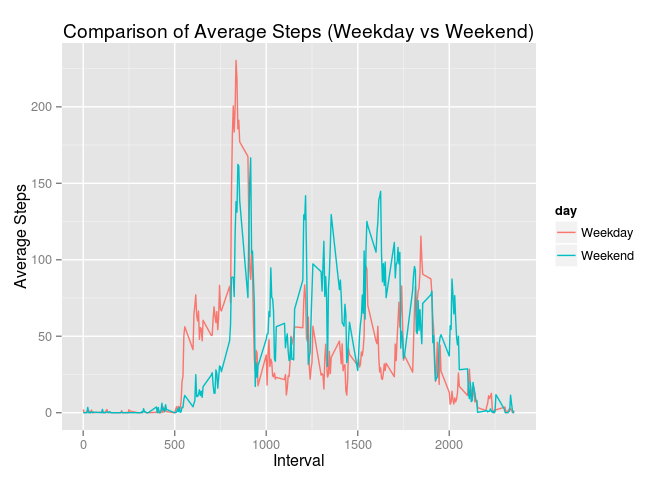

Reproducible Research: Peer Assessment 1
========================================

## Loading and preprocessing the data
Following piece of code extracts the zip file in data directory and reads it into activityData variable.

```r
#system("unzip activity.zip -d data/")
activityData <- read.csv("data/activity.csv")
library(dplyr)
library(ggplot2)
dim(activityData)
```

```
## [1] 17568     3
```


## What is mean total number of steps taken per day?


```r
completeData <- subset(activityData, complete.cases(activityData))
dataByDate <- completeData %>% group_by(date) %>% summarise(steps = sum(steps))
averageSteps <- round(mean(dataByDate$steps), digits = 0)
medianSteps <- median(dataByDate$steps)
g <- ggplot(dataByDate, aes(steps)) + geom_histogram(binwidth = 2000) +
  geom_vline(aes(xintercept=averageSteps), color="red", linetype="dashed", size=1) +
  xlab("Steps Per Day") + ylab("Frequency") + ggtitle("Histogram: Steps Per Day")
print(g)
```

 

```r
options(scipen=999)
```

Note: This is a historgram as opposed to a bar plot clearly showing frequency of distribution.

The mean of total number of steps per day is 10766 and median is 10765

## What is the average daily activity pattern?

```r
dataByInterval <- completeData %>% group_by(interval) %>% summarise(steps = mean(steps))
maxPoint <- data.frame(dataByInterval[dataByInterval$steps == max(dataByInterval$steps),])
g <- ggplot(dataByInterval, aes(interval, steps)) + geom_line() +
  xlab("Interval") + ylab("Average Steps") +
  geom_point(data = maxPoint, aes(interval, steps), color = "red") +
  geom_text(data = maxPoint, aes(x = interval * 1.15, y = steps, label = "Max", color = "red")) +
  theme(legend.position = "none")
    
print(g)
```

 

As the above graph shows, 5-minute interval with maximum steps is 835

## Imputing missing values

Missing data is filled by the code shown below. Missing data is filled using average steps for a given interval across all dates. 

```r
missingData <- activityData[!complete.cases(activityData),]
numMissing <- length(missingData)
source("FillIn.R")
imputedData <- FillIn(activityData, dataByInterval, "steps", "steps", c("interval"))
imputedDataByDate <- imputedData %>% group_by(date) %>% summarise(steps = sum(steps))
imputedAverageSteps <- round(mean(imputedDataByDate$steps), digits = 0)
imputedMedianSteps <- median(imputedDataByDate$steps)
g <- ggplot(imputedDataByDate, aes(steps)) + geom_histogram(binwidth = 2000) +
  geom_vline(aes(xintercept=imputedAverageSteps), color="red", linetype="dashed", size=1) +
  xlab("Steps Per Day") + ylab("Frequency") + ggtitle("Histogram: Steps Per Day")
print(g)
```

 

Total number of missing values: 2304

The mean of total number of steps per day is 10750 and median is 10641

The impact of imputing missing data is not visible on mean value given that mean calculated per interval is used to impute missing values. Median did change towards a slightly lower value.

## Are there differences in activity patterns between weekdays and weekends?

```r
library(lubridate)
imputedData$day <- as.factor(ifelse(weekdays(ymd(imputedData$date)) %in% c("Saturday","Sunday"), "Weekend", "Weekday"))
groupByDayInterval <- imputedData %>% group_by(day, interval) %>% summarise(steps = mean(steps))
g <- ggplot(groupByDayInterval, aes(x = interval, y = steps, color = day)) + geom_line() + facet_wrap(~day, nrow = 2) + 
  xlab("Interval") + ylab("Average Steps") + ggtitle("Comparison of Average Steps (Weekday vs Weekend)")
print(g)
```

 

One major thing visible is during weekdays there is peak around interval 800, while weekend seems to have a lot more activity throughout the day. Another way to see the difference is by plotting Weekday and Weekend on the same plot.


```r
groupByDayInterval <- imputedData %>% group_by(day, interval) %>% summarise(steps = mean(steps))
g <- ggplot(groupByDayInterval, aes(x = interval, y = steps, color = day)) + geom_line() +
  xlab("Interval") + ylab("Average Steps") + ggtitle("Comparison of Average Steps (Weekday vs Weekend)")
print(g)
```

 
